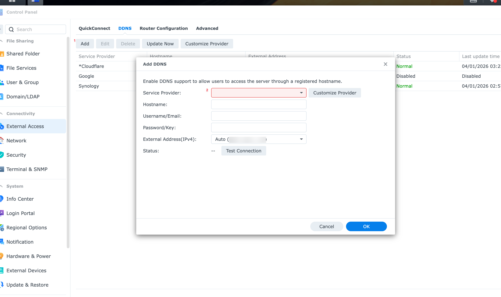
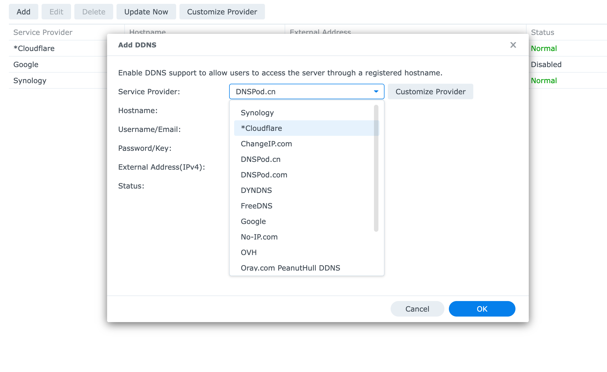
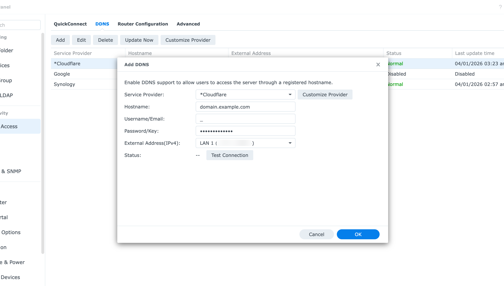

# Synology DSM Setup

This guide is for DSM users who already have a deployed Worker and now want Synology to use it like a normal DDNS provider.

When you finish, DSM should automatically call the Worker whenever your public IP changes.

Before you start, make sure the worker is already configured with:

- a deployed Worker URL
- a `DDNS_SHARED_SECRET`
- a hostname listed in `DDNS_ALLOWED_HOSTNAMES`

If you have not finished the Cloudflare side yet, go to [cloudflare-setup.md](./cloudflare-setup.md) first.

If you want the security tradeoffs behind this setup, read [security-model.md](./security-model.md). The short version is that DSM compatibility uses a shared secret, not a per-device identity model.

## What you need in front of you

- Your Synology NAS DSM web interface
- Your Worker URL, for example `https://cloudflare-ddns.example.workers.dev`
- The hostname you want DSM to update, for example `nas.example.com`
- The shared secret you chose during setup

## Step 1: Open the DDNS customization screen

In DSM, go to:

1. `Control Panel`
2. `External Access`
3. `DDNS`
4. `Customize Provider`

Open the custom provider dialog and confirm you are on the DDNS customization screen before you enter the Worker URL.


## Step 2: Create the custom provider

Fill in the custom provider form like this:

| Field | What to enter |
|---|---|
| Service provider | Any name you like, for example `Cloudflare DDNS` |
| Query URL | `https://<your-worker>.workers.dev/nic/update?hostname=__HOSTNAME__&myip=__MYIP__&username=__USERNAME__&password=__PASSWORD__` |

Then save the custom provider.

## Step 3: Add your DDNS entry

Back in the normal DDNS screen, create a new DDNS record using the provider you just added.



Start from the empty Add DDNS form so you can verify DSM is pointing at the custom provider you just created.



Open the service provider dropdown and choose the custom Cloudflare entry before you fill the rest of the form.



After you select the provider, fill the hostname, a placeholder username, and your shared secret exactly as shown in the field table below.

| Field | What to enter |
|---|---|
| Service provider | The custom provider you just saved |
| Hostname | Your real hostname, for example `nas.example.com` |
| Username | Any text you want. DSM requires a value, but this worker does not use it for authentication. |
| Password | Your `DDNS_SHARED_SECRET` |

## Step 4: Test the result

After saving, DSM should test the provider and show a successful result.

On success, the worker returns one of these values:

- `good <ip>` when the DNS record was created or updated
- `nochg <ip>` when the DNS record already matched your current IP

## Example values

If you want a copy-and-paste example, replace the placeholders below with your values:

| Item | Example |
|---|---|
| Query URL | `https://cloudflare-ddns.example.workers.dev/nic/update?hostname=__HOSTNAME__&myip=__MYIP__&username=__USERNAME__&password=__PASSWORD__` |
| Hostname | `nas.example.com` |
| Username | `synology` |
| Password | `your-shared-secret` |

## Common problems

### DSM says authentication failed

This usually means the password in DSM does not match `DDNS_SHARED_SECRET`.

### DSM says the hostname does not exist

This usually means the hostname is not included in `DDNS_ALLOWED_HOSTNAMES`.

### The record updates, but I still cannot reach the NAS

If you need direct NAS access on custom ports, keep `DDNS_PROXIED=false`. Proxied mode can break direct access patterns that are normal for NAS setups.

### I want one update to also refresh a wildcard record

Add both the exact hostname and the wildcard companion to `DDNS_ALLOWED_HOSTNAMES`, for example:

```text
nas.example.com,*.nas.example.com
```

That makes one request for `nas.example.com` update both DNS records.

### DSM keeps retrying after setup

Open the worker logs in Cloudflare and check whether the response is `badauth`, `nohost`, or `911`. Those map to bad password, disallowed hostname, or a server-side problem.

### I think the shared secret leaked

Create a new `DDNS_SHARED_SECRET` in Cloudflare first, then come back to DSM and replace the password in the DDNS entry with the new value.

After saving the new password, run the DSM test again. The old secret should stop working immediately once the Worker is using the new one.

If the Worker starts returning HTTP `429` with a `911` body, the built-in rate limit has probably slowed down repeated requests from the same client IP. Wait for the `Retry-After` period to pass, then test again with the new secret.